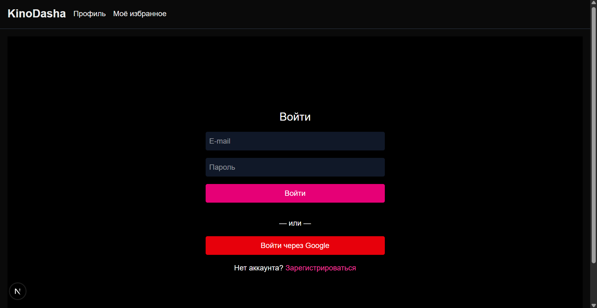
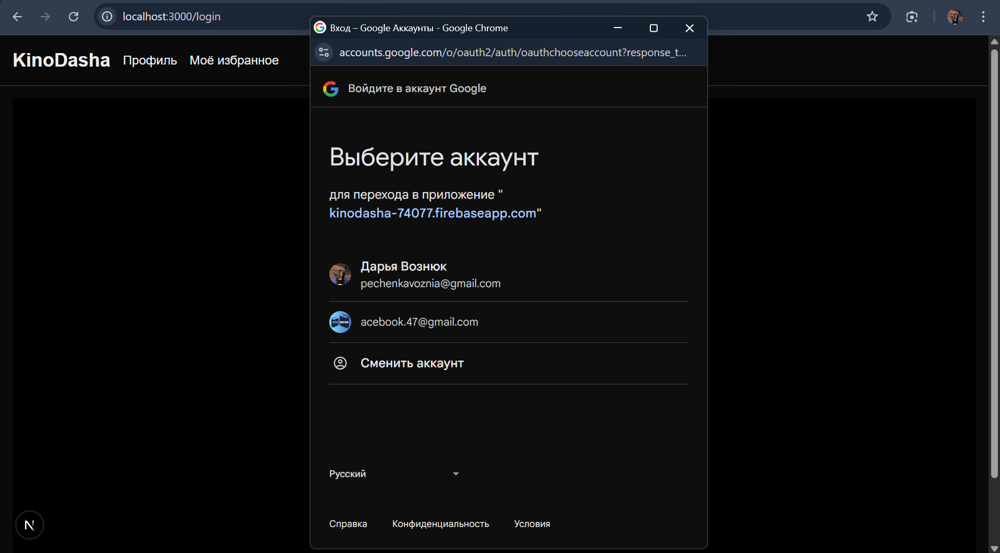

# KinoDasha 🎬
Интерактивный веб-приложение для поиска, фильтрации и добавления фильмов в избранное. Реализовано с помощью Next.js, Firebase и запускается через Docker.

## 🚀 Локальный запуск проекта (Docker)
### 1. Установите Docker
Скачайте и установите Docker Desktop.

После установки убедитесь, что Docker запущен (значок кита в трее).

### 2. Клонируйте проект
git clone https://github.com/ksssKesa/kinodasha
cd kinodasha

### 3. Создайте файл окружения
Создайте файл .env.local в корне проекта и добавьте туда свои ключи Firebase:

NEXT_PUBLIC_FIREBASE_API_KEY="..."
NEXT_PUBLIC_FIREBASE_AUTH_DOMAIN="..."
NEXT_PUBLIC_FIREBASE_PROJECT_ID="..."
NEXT_PUBLIC_FIREBASE_STORAGE_BUCKET="..."
NEXT_PUBLIC_FIREBASE_MESSAGING_SENDER_ID="..."
NEXT_PUBLIC_FIREBASE_APP_ID="..."
Пример:
(Проверьте, чтобы все значения были корректными — взять их можно в консоли Firebase в настройках проекта.)

### 4. Соберите Docker-образ
docker build -t kinodasha .

### 5. Запустите контейнер
docker run -p 3000:3000 kinodasha
Приложение будет доступно по адресу: http://localhost:3000

## 🛠️ Стек технологий
Next.js — фреймворк для React-приложений

TypeScript — строгая типизация

Firebase — база данных и аутентификация

Docker — контейнеризация и удобный локальный запуск

## ⚠️ Замечание
В связи с блокировками сервисов Google Cloud в России, деплой на Cloud Run не проводится. Проект полностью работоспособен и проверен при локальном запуске с помощью Docker.

______________________________

## Демонстрация веб-приложения KinoDasha

[🎬 Смотреть видео-демонстрацию на Google Диске](https://drive.google.com/file/d/1AI_sqmRN_pVfmTLMAXU9cssIwW_DWre6/view?usp=sharing)
